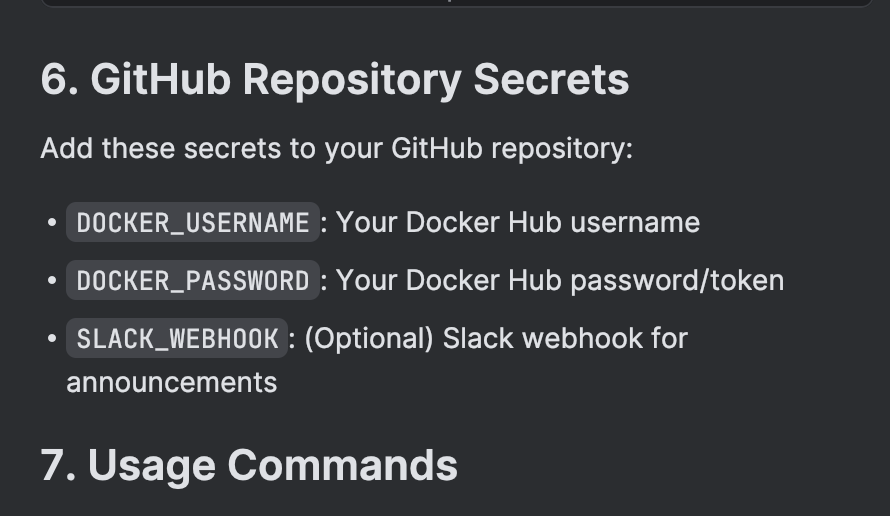

= AsciiDoctor Converter
:toc: left
:toclevels: 3
:icons: font
:source-highlighter: highlight.js

== Introduction

*AsciiDoctor Converter* is a powerful, high-performance service for converting AsciiDoc documents to various formats including HTML, PDF, and EPUB3. Built with Spring Boot and Kotlin, it leverages the latest Java 21 features including virtual threads for optimal performance.

This project aims to simplify the document conversion workflow for technical teams by providing:

* Asynchronous, scalable document processing
* Intelligent dependency tracking and incremental conversion
* Rich extension support for enhanced document features
* RESTful API for seamless integration with other systems
* Comprehensive monitoring and statistics

[.lead]
Transform your documentation workflow with enterprise-grade AsciiDoc conversion capabilities.

== Why AsciiDoctor Converter?

[cols="1,4", options="header"]
|===
|Challenge |Solution

|*Complex Documentation Pipelines*
|Streamline your documentation workflow with a service that handles the complexities of document conversion, dependency tracking, and output generation.

|*Performance Bottlenecks*
|Leverage modern Java 21 virtual threads and asynchronous processing for high-throughput document conversion.

|*Integration Difficulties*
|Connect seamlessly with your existing systems through our RESTful API and GitHub integration.

|*Limited Output Options*
|Generate multiple output formats (HTML, PDF, EPUB3) from a single source with customizable templates.

|*Poor Reader Experience*
|Enhance your documents with features like reading time estimation, copy-to-clipboard functionality, and syntax highlighting.
|===

== Key Features

=== Core Capabilities

* Convert AsciiDoc files to HTML, PDF, and EPUB3 formats
* Track file dependencies through include directives
* Perform incremental conversion (only convert changed files)
* Automatically re-convert parent files when includes change
* Copy non-AsciiDoc files to output directory
* Clean up deleted files from output directory
* Generate detailed conversion statistics and reports

=== Enhanced Document Features

* Reading time estimation for documents
* Copy-to-clipboard functionality for code blocks
* Source code highlighting with highlight.js
* User tracking and analytics capabilities
* Tab-based content switching
* Diagram generation support

=== Technical Highlights

* Built with Java 21 and Kotlin 2.1.21
* Utilizes Spring Boot 3.5.3 with virtual threads
* Asynchronous processing with CompletableFuture
* Thread-safe operations for concurrent processing
* Memory-efficient file processing
* Robust error handling and recovery
* Comprehensive logging with SLF4J
* RESTful API endpoints for document conversion
* GitHub API integration

== Getting Started

=== Prerequisites

* Java 21 or higher
* Maven 3.8+ (or use the included Maven wrapper)
* GraphViz (for diagram generation)

=== Quick Start

[source,bash]
----
# Clone the repository
git clone https://github.com/yourusername/asciidoctor-converter.git
cd asciidoctor-converter

# Build the project
./mvnw clean package

# Run the application
java -jar target/asciidoctor-converter-0.0.2-SNAPSHOT.jar
----

The service will be available at http://localhost:7202/converter

=== Using the API

[source,bash]
----
# Convert a single file
curl -X POST "http://localhost:7202/converter/convert" \
  -H "Content-Type: application/json" \
  -d '{"sourcePath": "/path/to/source.adoc", "targetPath": "/path/to/output"}'

# Convert a directory
curl -X POST "http://localhost:7202/converter/convert-directory" \
  -H "Content-Type: application/json" \
  -d '{"sourceDir": "/path/to/source", "targetDir": "/path/to/output"}'
----

== For Engineers

[quote, A satisfied developer]
____
AsciiDoctor Converter transformed our documentation pipeline from a bottleneck to a competitive advantage. The incremental conversion and dependency tracking saved us countless hours of manual work.
____

=== Why You'll Love It

* *Modern Stack*: Built with Kotlin and Spring Boot on Java 21, leveraging virtual threads for optimal performance
* *Extensible Architecture*: Easily add custom extensions and processors to enhance document generation
* *Developer-Friendly*: Comprehensive API, detailed logging, and robust error handling
* *Production-Ready*: Includes Docker configuration, health checks, and monitoring endpoints
* *Performance-Focused*: Asynchronous processing, incremental conversion, and efficient resource usage

=== Technical Deep Dive

The architecture follows modern best practices:

* *Service Layer*: Core conversion logic with dependency tracking
* *API Layer*: RESTful endpoints for integration
* *Extension System*: Pluggable components for document enhancement
* *Async Processing*: Non-blocking operations for scalability
* *Monitoring*: Comprehensive metrics and health checks

[source,kotlin]
----
@Service
class ConversionJobService(private val asciiDoctorConverter: AsciiDoctorConverter) {
    // Starts a PDF conversion job asynchronously
    fun startPdfConversion(files: List<File>, toDir: String): String {
        val jobId = UUID.randomUUID().toString()
        // Conversion logic with progress tracking
        // ...
        return jobId
    }
}
----

== Changelog

All notable changes to the AsciiDoctor Converter project will be documented in this file.

The format is based on [Keep a Changelog](https://keepachangelog.com/en/1.0.0/),
and this project adheres to [Semantic Versioning](https://semver.org/spec/v2.0.0.html).

=== [Unreleased]

==== Added

==== Changed

=== [0.0.2-SNAPSHOT] - 2025-07-25

==== Added
- User tracking functionality in generated HTML documents
- Cookie-based unique user identification system
- Session tracking and visit counting
- Analytics data collection with console logging
- Privacy-compliant tracking implementation

==== Changed
- Enhanced HTML output with embedded JavaScript tracking
- Improved docinfo integration for automatic script injection

=== [0.0.1-SNAPSHOT] - 2025-01-20

=== Added
- Initial project setup with Spring Boot 3.5.3
- Kotlin 2.1.21 support with coroutines
- AsciiDoctor Java integration (asciidoctorj 3.0.0)
- AsciiDoctor Diagram support (asciidoctorj-diagram 2.3.2)
- PDF generation capabilities (asciidoctorj-pdf 2.3.19)
- EPUB3 generation support (asciidoctorj-epub3 2.2.0)
- GitHub API integration (github-api 2.0-rc.3)
- Virtual threads support (enabled in Spring Boot)
- Spring Boot Actuator endpoints for monitoring
- RESTful API endpoints for document conversion
- File dependency tracking system
- Incremental conversion based on file changes
- Include directive parsing and dependency resolution
- Automatic cleanup of deleted files
- Support for non-AsciiDoc file copying
- Comprehensive conversion statistics tracking
- Configurable converter settings
- Source code highlighting with highlight.js
- URI read permissions for external resources
- Data URI embedding for self-contained HTML
- CSS copying and embedding
- Unsafe mode for full AsciiDoctor features
- Comprehensive logging with SLF4J
- Maven-based build system
- CycloneDX SBOM generation
- Spring Boot Maven plugin integration
- Kotlin Maven plugin with Spring support

==== Project Structure
- Created main application entry point (`App.kt`)
- Implemented core converter service (`AsciiDoctorConverter.kt`)
- Added GitHub client integration (`GithubClient.kt`)
- Created REST controller for web endpoints (`MainController`)
- Established configuration management (`ConverterSettings`)
- Set up resource management with application.yml
- Added docinfo directory for HTML customization
- Implemented comprehensive test structure

==== Configuration
- Server running on port 7202 with `/converter` context path
- GitHub API integration with token authentication
- Panel server integration at localhost:8010
- Local debug mode enabled
- Actuator endpoints exposed for monitoring
- Virtual threads enabled for improved performance

==== Dependencies
- Spring Boot Starter Web
- Spring Boot Starter Actuator
- Jackson Kotlin Module
- Kotlin Reflect and Standard Library
- AsciiDoctor Java with all major extensions
- DocOps Extension Plugin (2025.00)
- GitHub API client
- Comprehensive test dependencies

==== Features
- Convert individual AsciiDoc files to HTML
- Batch conversion of entire directories
- Dependency tracking between files via include directives
- Incremental conversion (only convert changed files)
- Automatic parent file re-conversion when includes change
- Copy non-AsciiDoc files to output directory
- Clean up deleted files from output directory
- Detailed conversion statistics and reporting
- Error handling and logging for failed conversions
- Flexible output directory configuration
- Support for AsciiDoctor attributes and options
- Integration with external services via configuration

==== Technical Highlights
- Built with modern Java 21 and Kotlin 2.1
- Utilizes Spring Boot 3.5.3 with virtual threads
- Comprehensive Maven build configuration
- Production-ready with actuator endpoints
- Extensible architecture for future enhancements
- Thread-safe operations for concurrent processing
- Memory-efficient file processing
- Robust error handling and recovery

== 🐳 Docker next

Looking at your Spring Boot application, I can see it's an AsciiDoc converter with specific directory configurations and logging setup. Here's the recommended way to dockerize this app:Based on your Spring Boot application that converts AsciiDoc files, here's the recommended way to dockerize it:

== 🐳 Dockerfile

[source,dockerfile]
----
# Use a multi-stage build to optimize the final image size
FROM eclipse-temurin:21-jdk-jammy AS builder

# Set working directory
WORKDIR /app

# Copy Maven wrapper and pom.xml first (for better layer caching)
COPY pom.xml mvnw ./
COPY .mvn .mvn

# Make Maven wrapper executable
RUN chmod +x ./mvnw

# Download dependencies (this layer will be cached if pom.xml doesn't change)
RUN ./mvnw dependency:go-offline

# Copy source code
COPY src ./src

# Build the application
RUN ./mvnw clean package -DskipTests

# Runtime stage
FROM eclipse-temurin:21-jre-jammy

# Install GraphViz for diagram generation (used by asciidoctor-diagram)
RUN apt-get update && \
    apt-get install -y graphviz && \
    rm -rf /var/lib/apt/lists/*

# Create app user for security
RUN groupadd -r appuser && useradd -r -g appuser appuser

# Set working directory
WORKDIR /app

# Create necessary directories
RUN mkdir -p /app/logs /app/tmp && \
    chown -R appuser:appuser /app

# Copy the JAR file from builder stage
COPY --from=builder /app/target/*.jar app.jar

# Change ownership to app user
RUN chown appuser:appuser app.jar

# Switch to non-root user
USER appuser

# Expose the port your app runs on
EXPOSE 7202

# Health check
HEALTHCHECK --interval=30s --timeout=10s --start-period=60s --retries=3 \
  CMD curl -f http://localhost:7202/converter/actuator/health || exit 1

# Run the application
CMD ["java", "-jar", "app.jar"]
----

== 🐳 Docker Compose

[source,yaml]
----
version: '3.8'

services:
  asciidoctor-converter:
    build: .
    ports:
      - "7202:7202"
    environment:
      - SPRING_PROFILES_ACTIVE=docker
      - ENCRYPTION_KEY=your-secure-32-character-key-here
      - GITHUB_STAGING_DIR=/app/staging
      - GITHUB_WEB_DIR=/app/web
      - GITHUB_DISABLE_SSL=false
    volumes:
      # Mount volumes for persistent data
      - ./logs:/app/logs
      - ./staging:/app/staging
      - ./web:/app/web
      - ./tmp:/app/tmp
    restart: unless-stopped
    healthcheck:
      test: ["CMD", "curl", "-f", "http://localhost:7202/converter/actuator/health"]
      interval: 30s
      timeout: 10s
      retries: 3
      start_period: 60s
----

== 🐳 Docker-specific Configuration

[source,yaml]
----
server:
  port: 7202
  servlet:
    context-path: /converter

management:
  endpoints:
    web:
      exposure:
        include: health, info, loggers, metrics, beans, mappings, threaddump, heapdump, swagger-ui, sbom

github:
  staging:
    directory: ${GITHUB_STAGING_DIR:/app/staging}
  web:
    directory: ${GITHUB_WEB_DIR:/app/web}
  disable:
    ssl:
      validation: ${GITHUB_DISABLE_SSL:false}

converter:
  panel-server: http://localhost:8010/extension
  panel-webserver: http://localhost:8010/extension
  local-debug: false

app:
  execution-history:
    max-size: 10
  encryption:
    key: ${ENCRYPTION_KEY:your-32-character-secret-key-here}
  security:
    allowed-base-paths:
      - "/app/staging"
      - "/app/web"
      - "/app/tmp"

spring:
  threads:
    virtual:
      enabled: true

logging:
  file:
    name: /app/logs/application.log
  level:
    root: INFO
  pattern:
    file: "%d{yyyy-MM-dd HH:mm:ss.SSS} [%thread] %-5level %logger{36} - %msg%n"
    console: "%d{HH:mm:ss.SSS} [%thread] %-5level %logger{36} - %msg%n"
  logback:
    rollingpolicy:
      max-file-size: 5MB
      max-history: 10
      total-size-cap: 250MB
      file-name-pattern: /app/logs/application-%d{yyyy-MM-dd}.%i.log.gz
      clean-history-on-start: true
----

== .dockerignore

[source,ignorelang]
----
# Exclude unnecessary files from Docker build context
target/
logs/
*.log
.git/
.gitignore
README.md
*.md
.idea/
*.iml
.DS_Store
----

== Key Docker Features:

1. **Multi-stage build**: Reduces final image size by separating build and runtime environments
2. **Security**: Runs as non-root user for better security
3. **GraphViz**: Installs GraphViz for diagram generation support
4. **Health checks**: Built-in health monitoring
5. **Volume mounts**: Persistent storage for logs and data
6. **Environment variables**: Configurable through environment variables
7. **Spring profiles**: Uses Docker-specific configuration

== Running the Application:

[source,shell script]
----
# Build and run with Docker Compose
docker-compose up --build

# Or build and run manually
docker build -t asciidoctor-converter .
docker run -p 7202:7202 \
  -e ENCRYPTION_KEY=your-secure-32-character-key-here \
  -v $(pwd)/logs:/app/logs \
  -v $(pwd)/staging:/app/staging \
  asciidoctor-converter
----

== Important Notes:

1. **Security**: Replace the default encryption key with a secure 32-character key
2. **Volumes**: Mount appropriate directories for persistent data
3. **Memory**: Consider adding JVM memory settings if needed: `-Xmx512m -Xms256m`
4. **Networking**: If you need to connect to external services, configure networking appropriately

This setup provides a production-ready Docker configuration for your AsciiDoc converter application.

[source,shell]
----
# Dry run to test configuration
./mvnw jreleaser:config

# Create a release (after creating a git tag)
git tag v0.1.0
git push origin v0.1.0

# Manual release (if not using GitHub Actions)
./mvnw jreleaser:full-release
----